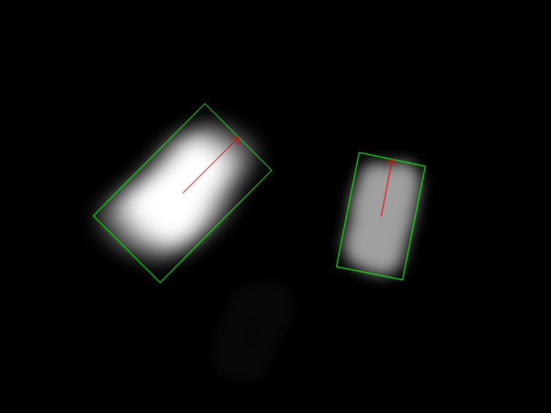
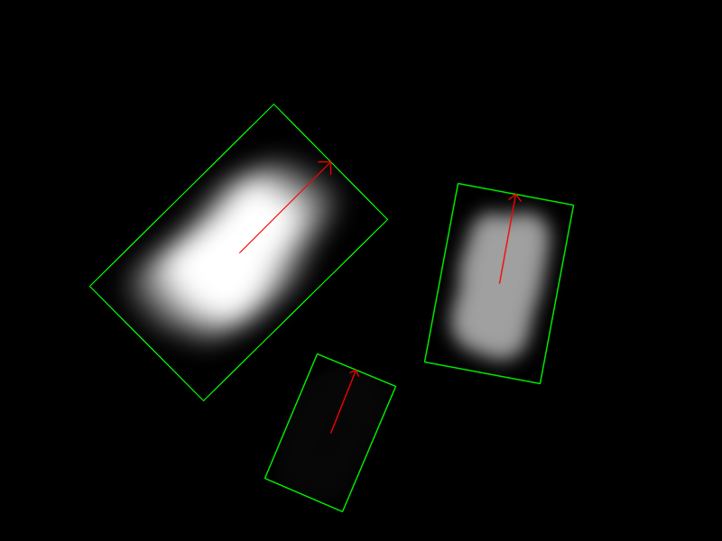
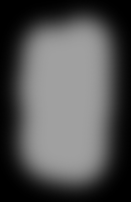

# Bounding box extraction
Minimal bounding box extraction and alignment. This project is implmentation of recruitment task for Konica - Research Position.

## Overview

Main purpose of this project is implementation of an algorithm for minimal bounding box extraction from segmentation map. Additionaly each of extracted bounding boxes is alligned to the xy axis with the longer dimnesion being aligned to the y axis. This project can be used directly with the existing example or as a pip package library.

## Getting started
### Prerequisites and usage
#### Using Docker Compose
```sh
docker-compose build
docker-compose run app -i assignment/RS_homework_BB.png -o output -t 4 -a True -c
```

The same can be achieved using Makefile
```sh
make build
COMMAND="-i assignment/RS_homework_BB.png -o output -t 4 -a True -c" make run
```

#### Using Docker
```sh
docker build . -t python-template --target build
docker run -v ${PWD}:/app -w /app -it python-template -i input/test.png -o output -t 4 -a True -c
```

#### Using Pip
```
pip install -r requirements.txt
python main.py -i input/test.png -o outputs -t 128 -o output -t 4 -a True -c -v
```

### Arguments
- `-i`, `--input` TEXT          Input file for bbox extraction.
- `-o`, `--output` TEXT         Directory to store extracted bbox images. (default `output/{input_filename}`)
- `-t`, `--threshold` INTEGER   Image intensity threshold used to extract contours. (`0`-`255`, default `4`)
- `-a`, `--align` BOOLEAN       Align the bbox dominant dimension with the Y axis. (default `True`)
- `-c`, `--center` BOOLEAN      Center bbox around the contour. (default `False`)
- `-f`, `--min_factor` INTEGER  Bounding box dimension will be divisible by specified value. (default `1`)
- `-v`, `--visual`              Input image and bounding box visualization using `opencv.imshow`.

### Using as a Pip package
#### From git
```sh
pip install git+https://github.com/mroncka/python-template.git
```
#### Locally
```sh
git clone git@github.com:mroncka/python-template.git && cd python-template && pip install -e .
```

#### Usage
```python
import cv2
from image_extraction.bbox import get_bounding_boxes

image = cv2.imread(input, cv2.IMREAD_GRAYSCALE)
bboxes = get_bounding_boxes(image)
for i, bbox in enumerate(bboxes):
    crop = bbox.crop_axis_aligned(image)
```

#### Examples
```python
python example.py min
python example.py visual
python example.py rotation
```

### Running tests
#### Using Docker Compose (ideally - clean environment)
```sh
docker-compose build
docker-compose run test
```
The same can be achieved using Makefile
```sh
make build
make test
```

#### Locally
```sh
pip install -r test_requirements.txt
pytest tests
```

### Example input and output


### Found contours with threshold values of `4` and `64` (specified by `-t` argument)
 |  | 

 |  |  | 
