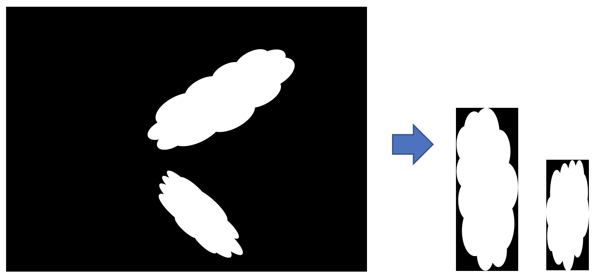

# Bounding box extraction
Minimal bounding box extraction and alignment. This project is implmentation of recruitment task for Konica - Research Position.

## Overview

Main purpose of this project is implementation of an algorithm for minimal bounding box extraction from segmentation map. Additionaly each of extracted bounding boxes is alligned to the xy axis with the longer dimnesion being aligned to the y axis. This project can be used directly with the existing example or as a pip package library.

## Getting started
### Prerequisites and usage
#### Using Docker (Recommended)
```
docker build . -t konica-bbox-extraction
docker run -it konica-bbox-extraction run.py -i inputs/test.png -o outputs/test -t 128
```

#### Using Pip
```
pip install -r requirements.txt
python run.py -i inputs/test.png -o outputs/test -t 128
```
### Arguments
- `-i` - input file
- `-o` - output directory (default `output/{input_filename}`)
- `-t` - threshold specification (`0`-`255`, default `8`)
- `-v` - enable window visualization


### Example input


### Sample output

